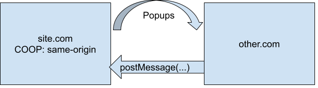
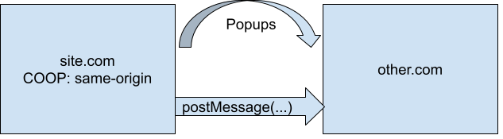
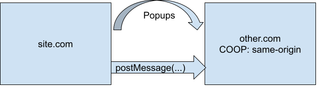
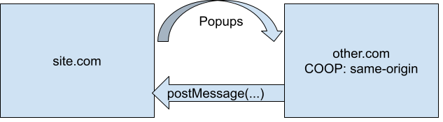
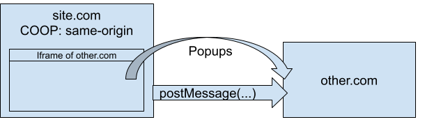
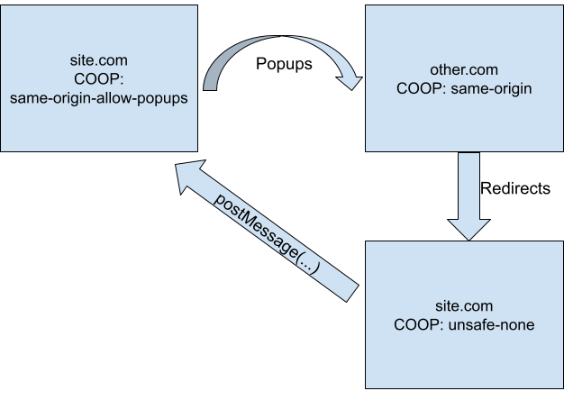
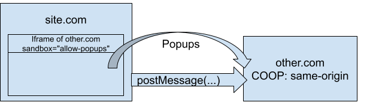

# Rolling out COOP

## Enabling COOP Report-Only

COOP supports a report-only mode that can be configured via a `Cross-Origin-Opener-Policy-Report-Only` header. This report-only mode can be used to find which parts of your site depend on either opening and interacting with popups or being opened in a popup and interacting with the opener. To configure COOP reports to be sent to your report collector, set the response headers:

```
cross-origin-opener-policy: same-origin; report-to="myReportingGroupName"
report-to: {"group":"myReportingGroupName","max_age":2592000,"endpoints":[{"url":"https://example.com/reports-collector"}]}
```

Note: There are a number of different existing report collectors including report-uri.com, uriports.com, and [this sample OSS implementation on Glitch.](https://glitch.com/edit/#!/reporting-endpoint)

## Understanding COOP Reports

This will cause browsers to send information about popup interactions to `https://example.com/reports-collector`. For example, if `foo.example` opened `bar.example/foo` in a popup and sent it a message via `postMessage`, you would receive a report like:

```
{
    "age":6,
    "body":{
        "disposition": "reporting",
        "effectivePolicy": "same-origin",
        "property": "postMessage",
        "referrer": "foo.example",
        "type":"access-to-coop-page-from-opener"
    },
    "type":"coop",
    "url":"bar.example/foo",
    "user_agent":"Mozilla/5.0 (X11; Linux x86_64) AppleWebKit/537.36 (KHTML, like Gecko) Chrome/87.0.4280.141 Safari/537.36"
}
```

Note that this report has a number of useful pieces of information in it. It tells you:

1. The `url` of the page that was opened in a popup (the **openee**)
2. The `referrer`, which tells you what the third-party site was (the **opener**)
3. The `property` that was accessed
4. The `type` of violation

This last field, the `type` field is one of the most important. It tells you that this was an access to a COOP page (aka the page that is setting the COOP report-only header) from the opener of that page (aka that the COOP page is the one in a popup). In this case, if this is something that your site needs to support, you would need to ensure that `bar.example/foo` sets a COOP policy of `unsafe-none`. 

There are 6 different `type`s that a COOP report may specify. The `type` tells you what policy change is necessary in order to allow the behavior that triggered the report. 

### Access to COOP Page From Openee

This violation type means that a COOP page opened a cross-origin page that tried to access a field on its opener, e.g. `window.opener.field`. One common way this can happen is if you open a popup that sends a message to your page.



This violation type can be fixed by setting `same-origin-allow-popups` on the COOP page that opened the window.

### Access from COOP Page To Openee

This violation type means that a COOP page opened a cross-origin page and accessed a field of that window. For example, `window.open(other_site).field`. One common way this can happen is if you open a popup and send a message to it via postMessage.



This violation type can be fixed by setting `same-origin-allow-popups` on the COOP page that opened the window.

### Access to COOP Page From Opener

This violation type means that a page opened a cross-origin COOP page and tried to access a field on its opener, e.g. `window.open(other_site_with_coop).field`. One common way this can happen is if you open a popup and send a message to it via postMessage.



This violation type can be fixed by setting `unsafe-none` on the page that is being opened.

### Access From COOP Page To Opener

This violation type means that a page opened a cross-origin COOP page that did `window.opener.field`. One common way this can happen is if you open a popup that sends a message to your page.



This violation type can be fixed by setting `unsafe-none` on the page that is being opened.

### Access To COOP Page From Other

This rarer violation type means that a COOP page was accessed by a cross-origin page that doesn’t have an opener or an openee relationship with the COOP page. This can be thought of as a catchall category. One example of a way this kind of report can be triggered is if a window reference is obtained via `window.open('', 'name_of_window')`.

This violation type can be fixed by setting `unsafe-none` on the page that is being accessed.

### Access From COOP Page To Other

This rarer violation type means that a COOP page tried to access a field on another page that it doesn’t have an opener or an openee relationship with. This can be thought of as a catchall category. One example of a way this kind of report can be triggered is if a window reference is obtained via `window.open('', 'name_of_window')`.

This violation type can be fixed by setting `unsafe-none` on the page that is doing the access.

## Common Difficulties

### Coop Reporting Gaps

COOP's report-only mode is meant to allow you to find the places on your site that depend on interactions with popups. It will report almost all of these interactions, but there are a few edge cases under which a site could trigger no COOP reports, yet still break when enforcement is enabled. These are relatively rare edge cases, but human review is the only way to ensure that a site does not fall into any of these gaps.

#### Case 1: Iframe Window Interactions

If a page enables COOP, all iframes on that page also get COOP enforced. This means that if a page enables COOP and it embeds a page that needs to open popups and interact with them, it may break. See this diagram:



#### Case 2: Redirect Breakages

If:

1. A page enables COOP enforcement
2. That page redirects to a page without COOP enforcement
3. Some other service `window.open`s the page with COOP enforcement
4. That service then tries to use the window reference for cross-origin communication

Then things can break. See this diagram:



This is most likely to occur in terms of login flows where a popup is often redirected to a final page that needs to use `postMessage`. In this case, every piece of the redirect chain must enforce a policy of `unsafe-none`.

#### Case 3: Iframe Sandbox Breakages

If:

1. A page contains an iframe with `sandbox="allow-popups"` but without `allow-popups-to-escape-sandbox`
2. That iframe opens a popup to `example.com/endpoint`
3. `example.com/endpoint` enforces COOP

Then the opened popup will show a network error page with the error `CoopSandboxedIFrameCannotNavigateToCoopPage`. See this diagram:



### Atomic Per User Rollouts

Due to some quirks of how COOP works, it must be rolled out atomically for a given user. So when enabling COOP enforcement ensure that a user will never fall into a scenario where one request has COOP enforced, and the next one doesn't. Read on to find out why! 

In addition to restricting communication between two tabs, COOP also affects how a browser allocates Browser Context Groups (aka BCGs, a concept similar to processes). Separate tabs/windows can only interact with each other if they are in the same BCG.

Example: Suppose that we're rolling out COOP for a service where `example.com/foo` opens a popup to `example.com/bar`. Since all popups are `same-origin`, we can enforce `COOP: same-origin` on this service. But, suppose that during the rollout a user's request to `example.com/foo` hits prod and `example.com/bar` hits canary. In this case, a page with an implicit policy of `unsafe-none` opens a popup to an endpoint that has a policy of `same-origin`. This triggers a BCG switch and thus prevents the two pages from interacting.

Because of this, if a service uses any `same-origin` popups, it is essential that COOP is forced atomically for a given user. As our data provides no way of tracking same-origin popups, we're forced to assume that every service uses `same-origin` popups.

**Note:** If you know that your service does not need to interact with any `same-origin` popups, then it is safe to roll out COOP gradually.

### Client-side navigation

If your site uses client-side navigation, special care needs to be taken when handling `same-origin-allow-popups` exemptions. Suppose that `example.com/foo` needs to open and interact with popups. So you might think you should just ensure that `/foo` sets `same-origin-allow-popups` and that the rest of the site can set `same-origin`. But, if `example.com` uses client-side navigation then the user can go to `example.com`, get a `COOP: same-origin` header, and then client-side navigate to `/foo`. This would happen without an HTTP request to `/foo` and thus the user would end up on `/foo` without having seen the `COOP: same-origin-allow-popups` header. Thus, if your site uses client-side navigation, if one page needs to open popups then the entire site needs to use the relaxed `same-origin-allow-popups` policy value.

### Common Noise

COOP reports are generally not noisy, most of the time a reported violation is a real concern. There are a few common classes of violation reports that are worth considering ignoring:

1. Reports from extensions. You may see reports where the URL or the referrer is a `chrome-extension://` URL. Some chrome extensions interact with pop ups in a way that COOP will break. It is up to you whether or not breaking this is ok for your service. 
2. Reports from third party sites opening your site in a popup and monitoring whether it has been closed. Many websites on the internet track whether a popup has been closed or not. Oftentimes this is not something that your service intends to support and thus it is often okay to ignore these violations.
